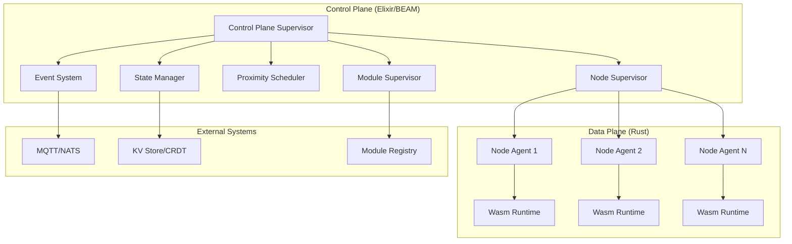
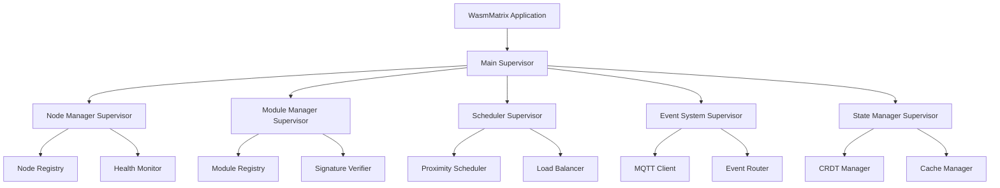
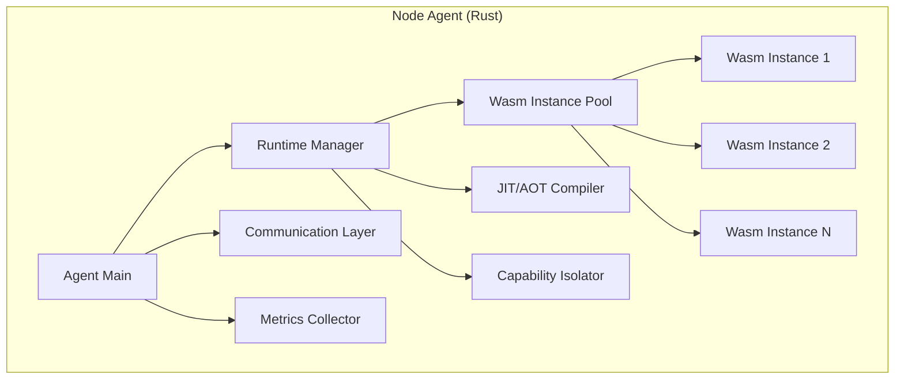

# Design Document: WasmMatrix

## Overview

WasmMatrix is a next-generation WebAssembly runtime platform that leverages Elixir's OTP (Open Telecom Platform) for the control plane and Rust for the data plane. The platform is designed around the principle that WebAssembly's millisecond startup times enable a "kill-and-restart" fault tolerance strategy, fundamentally different from traditional container orchestration.

The architecture prioritizes proximity and speed over resource utilization, making it ideal for edge computing, IoT, and real-time control systems. By embracing a stateless execution model with external state management, WasmMatrix achieves massive parallelism and fault tolerance through the BEAM VM's actor model.

## Architecture

### High-Level Architecture



### Control Plane Architecture (Elixir/OTP)

The control plane follows OTP supervision patterns with a hierarchical supervisor tree:



### Data Plane Architecture (Rust)

Each node runs a Rust-based agent that manages local WebAssembly execution:



## Components and Interfaces

### Control Plane Components

#### Node Manager (Elixir GenServer)
- **Responsibilities**: Node registration, health monitoring, capability tracking
- **State**: Map of node_id → node_metadata
- **Interface**: 
  ```elixir
  {:register_node, node_id, capabilities, location}
  {:update_health, node_id, health_status}
  {:get_available_nodes, constraints}
  ```

#### Module Manager (Elixir GenServer)
- **Responsibilities**: Wasm module storage, versioning, signature verification
- **State**: Module registry with version history
- **Interface**:
  ```elixir
  {:register_module, module_id, binary, signature, capabilities}
  {:get_module, module_id, version}
  {:verify_signature, module_binary, signature}
  ```

#### Proximity Scheduler (Elixir GenServer)
- **Responsibilities**: Intelligent placement decisions based on proximity, data locality, and fault domains
- **Algorithm**: Multi-criteria decision making with weighted scoring
- **Interface**:
  ```elixir
  {:schedule_module, module_id, constraints, origin_location}
  {:reschedule_on_failure, module_id, failed_node_id}
  ```

#### Event System (Elixir GenServer + MQTT/NATS)
- **Responsibilities**: Event-driven lifecycle management, pub/sub coordination
- **Integration**: MQTT/NATS client with Elixir message passing
- **Interface**:
  ```elixir
  {:publish_event, topic, payload}
  {:subscribe_to_events, topic, callback_pid}
  {:trigger_lifecycle, event_type, module_id, params}
  ```

#### State Manager (Elixir GenServer + CRDT)
- **Responsibilities**: External state coordination, local caching, CRDT synchronization
- **Storage**: Integration with external KV stores and CRDT systems
- **Interface**:
  ```elixir
  {:get_state, key, consistency_level}
  {:update_state, key, value, merge_function}
  {:invalidate_cache, key}
  ```

### Data Plane Components

#### Node Agent (Rust)
- **Responsibilities**: Local Wasm execution, resource management, metrics collection
- **Architecture**: Async Rust with tokio runtime
- **Interface**: gRPC server exposing:
  ```rust
  rpc StartModule(StartModuleRequest) returns (StartModuleResponse);
  rpc StopModule(StopModuleRequest) returns (StopModuleResponse);
  rpc GetMetrics(GetMetricsRequest) returns (GetMetricsResponse);
  ```

#### Wasm Runtime Integration
- **Primary Runtime**: Wasmtime (based on research showing good performance for edge computing)
- **Compilation Strategy**: JIT for development, AOT for production edge deployment
- **Capability Enforcement**: WASI-based permission system with custom extensions

#### Communication Layer
- **Control Plane Communication**: gRPC with Protocol Buffers
- **Event Integration**: MQTT/NATS client for event-driven operations
- **Metrics**: Prometheus-compatible metrics export

## Data Models

### Node Metadata
```elixir
%Node{
  id: String.t(),
  location: %{lat: float(), lon: float(), zone: String.t()},
  capabilities: %{
    architectures: [String.t()],
    memory_mb: integer(),
    cpu_cores: integer(),
    specialized_hardware: [String.t()]
  },
  health_status: :healthy | :degraded | :unhealthy,
  current_load: %{
    cpu_percent: float(),
    memory_percent: float(),
    active_modules: integer()
  },
  last_heartbeat: DateTime.t()
}
```

### Wasm Module Metadata
```elixir
%WasmModule{
  id: String.t(),
  name: String.t(),
  version: String.t(),
  binary_hash: String.t(),
  signature: String.t(),
  capabilities: %{
    required_permissions: [String.t()],
    resource_limits: %{
      max_memory_mb: integer(),
      max_cpu_time_ms: integer(),
      allowed_syscalls: [String.t()]
    }
  },
  deployment_config: %{
    target_architectures: [String.t()],
    preferred_locations: [String.t()],
    scaling_policy: %{
      min_instances: integer(),
      max_instances: integer(),
      scale_trigger: String.t()
    }
  },
  created_at: DateTime.t(),
  updated_at: DateTime.t()
}
```

### Scheduling Decision
```elixir
%SchedulingDecision{
  module_id: String.t(),
  selected_nodes: [String.t()],
  decision_factors: %{
    proximity_score: float(),
    resource_score: float(),
    data_locality_score: float(),
    fault_domain_score: float()
  },
  fallback_nodes: [String.t()],
  decision_time_ms: integer(),
  expires_at: DateTime.t()
}
```

### Event Message
```elixir
%EventMessage{
  id: String.t(),
  type: :module_start | :module_stop | :node_failure | :scale_event,
  source: String.t(),
  target: String.t(),
  payload: map(),
  correlation_id: String.t(),
  timestamp: DateTime.t(),
  retry_count: integer()
}
```

## Correctness Properties

*A property is a characteristic or behavior that should hold true across all valid executions of a system-essentially, a formal statement about what the system should do. Properties serve as the bridge between human-readable specifications and machine-verifiable correctness guarantees.*

### Property 1: Node Registration and Health Monitoring
*For any* edge node that starts up, the Control_Plane should register the node, begin health monitoring, and maintain accurate real-time inventory of the node's capabilities and status.
**Validates: Requirements 1.1, 1.4**

### Property 2: Node Failure Detection and Recovery
*For any* node that fails to respond to heartbeat checks, the Control_Plane should mark it as unavailable, redistribute workloads to healthy nodes within 100ms, and re-register it when it recovers.
**Validates: Requirements 1.2, 1.3, 6.2**

### Property 3: Cryptographic Signature Verification
*For any* Wasm module uploaded or deployed, the Control_Plane should verify its cryptographic signature before acceptance, reject modules with invalid signatures, and log security violations.
**Validates: Requirements 2.1, 2.5, 3.4**

### Property 4: Module Version Management and Rollback
*For any* Wasm module stored in the system, the Control_Plane should maintain complete version history and support rollback to any previous version within 10ms.
**Validates: Requirements 2.2, 3.2**

### Property 5: Capability-Based Permission Enforcement
*For any* Wasm module execution, the Node_Agent should strictly enforce capability-based permissions, deny unauthorized operations, log security violations, and provide memory isolation between instances.
**Validates: Requirements 2.3, 3.3, 8.1, 8.2, 8.3**

### Property 6: Proximity-Based Scheduling Optimization
*For any* scheduling decision, the Proximity_Scheduler should prioritize nodes based on network latency and geographic proximity, consider data locality, distribute across fault domains, and complete placement decisions within 5ms for edge workloads.
**Validates: Requirements 4.1, 4.3, 4.4, 4.5, 4.6**

### Property 7: Resource-Aware Scheduling
*For any* node evaluation during scheduling, the Proximity_Scheduler should consider CPU architecture, memory, specialized hardware, and maintain architecture compatibility matrices for appropriate placement.
**Validates: Requirements 4.2, 11.2, 11.5**

### Property 8: Fast Lifecycle Management
*For any* Wasm module lifecycle operation, the system should achieve sub-millisecond startup times, coordinate parallel scaling operations, and use kill-and-restart strategies for updates and recovery.
**Validates: Requirements 5.1, 5.2, 5.3, 5.4, 5.5**

### Property 9: Supervisor-Based Fault Tolerance
*For any* Wasm process crash or system failure, the Supervisor should restart processes immediately using configured strategies, implement circuit breaker patterns for cascading failures, and maintain fault tolerance metrics.
**Validates: Requirements 6.1, 6.3, 6.4**

### Property 10: High-Performance Execution
*For any* Wasm module execution, the Node_Agent should provide near-native performance, support massive parallelism without degradation, minimize memory overhead per instance, and maintain efficient context switching.
**Validates: Requirements 7.2, 7.3, 7.4, 7.5**

### Property 11: Event-Driven On-Demand Execution
*For any* system event, the Control_Plane should publish events with guaranteed delivery, spawn modules on-demand rather than maintaining persistent instances, and implement retry mechanisms with exponential backoff for failed processing.
**Validates: Requirements 9.1, 9.2, 9.3**

### Property 12: Event System Stability and Routing
*For any* event processing scenario, the Control_Plane should implement backpressure mechanisms during event storms and support event filtering and routing based on content and metadata.
**Validates: Requirements 9.4, 9.5**

### Property 13: Stateless Architecture with External State
*For any* Wasm module design, the Control_Plane should enforce stateless principles, provide access to external KV stores and CRDT systems when state is required, and implement local caching similar to BEAM's ETS for performance optimization.
**Validates: Requirements 10.1, 10.2, 10.3, 10.4**

### Property 14: Multi-Architecture Support and Optimization
*For any* deployment across different architectures, the Node_Agent should support x86, ARM, and RISC-V processors, optimize compilation for target architecture capabilities, and expose architecture-specific features through controlled capabilities.
**Validates: Requirements 11.1, 11.3, 11.4**

### Property 15: Comprehensive Observability
*For any* system operation, the platform should collect performance metrics and resource usage statistics, generate structured logs with correlation IDs, expose metrics via standard interfaces, generate alerts for anomalies, and provide distributed tracing capabilities.
**Validates: Requirements 12.1, 12.2, 12.3, 12.4, 12.5**

### Property 16: Registry and State Consistency
*For any* module registration, deployment, or state change, the Control_Plane should maintain consistent registries of modules and their locations, update metadata within 100ms, and provide seamless API integration with Wasm module capabilities.
**Validates: Requirements 1.5, 2.4, 3.1, 3.5, 10.5**

### Property 17: Hardware Security Integration
*For any* cryptographic operation, the Node_Agent should use hardware security features when available and the Control_Plane should maintain tamper-evident audit logs for all security-relevant operations.
**Validates: Requirements 8.4, 8.5**

### Property 18: Real-Time Lifecycle Tracking
*For any* lifecycle state change, the Control_Plane should track and report changes in real-time, log detailed failure and recovery information, and maintain accurate system state.
**Validates: Requirements 5.6, 6.5**

## Error Handling

### Control Plane Error Handling

The Elixir control plane leverages OTP's "let it crash" philosophy with structured error handling:

#### Supervisor Strategies
- **One-for-One**: Individual GenServer failures don't affect siblings
- **One-for-All**: Critical component failures restart the entire supervision tree
- **Rest-for-One**: Failures cascade only to dependent processes

#### Error Categories and Responses
1. **Transient Errors**: Automatic retry with exponential backoff
2. **Node Communication Failures**: Circuit breaker pattern with fallback routing
3. **Module Signature Failures**: Immediate rejection with security audit logging
4. **Scheduling Failures**: Fallback to alternative nodes with degraded service alerts
5. **State Consistency Errors**: CRDT conflict resolution with eventual consistency

#### Error Recovery Patterns
```elixir
# Example supervisor restart strategy
def init(_) do
  children = [
    {NodeManager, restart: :permanent, shutdown: 5000},
    {ModuleManager, restart: :permanent, shutdown: 5000},
    {ProximityScheduler, restart: :transient, shutdown: 10000}
  ]
  
  Supervisor.init(children, strategy: :one_for_one, max_restarts: 3, max_seconds: 5)
end
```

### Data Plane Error Handling

The Rust data plane implements structured error handling with graceful degradation:

#### Error Types
```rust
#[derive(Debug, Error)]
pub enum WasmRuntimeError {
    #[error("Module compilation failed: {0}")]
    CompilationError(String),
    
    #[error("Capability violation: {0}")]
    CapabilityViolation(String),
    
    #[error("Resource limit exceeded: {0}")]
    ResourceLimitExceeded(String),
    
    #[error("Communication error: {0}")]
    CommunicationError(String),
}
```

#### Recovery Strategies
1. **Module Crashes**: Immediate restart with clean state
2. **Resource Exhaustion**: Graceful degradation with load shedding
3. **Communication Failures**: Retry with circuit breaker
4. **Capability Violations**: Security logging and module termination

## Testing Strategy

### Dual Testing Approach

The testing strategy combines unit testing for specific scenarios with property-based testing for comprehensive coverage:

#### Unit Testing Focus
- **Integration Points**: Control plane to data plane communication
- **Edge Cases**: Boundary conditions for performance requirements
- **Error Conditions**: Specific failure scenarios and recovery paths
- **Security Scenarios**: Capability violations and signature failures

#### Property-Based Testing Focus
- **Universal Properties**: All correctness properties from the design
- **Comprehensive Input Coverage**: Randomized testing across all system inputs
- **Performance Validation**: Statistical validation of timing requirements
- **Fault Injection**: Random failure scenarios to test fault tolerance

### Property-Based Testing Configuration

**Testing Framework**: 
- **Elixir**: StreamData for property-based testing
- **Rust**: proptest for data plane property testing

**Test Configuration**:
- **Minimum Iterations**: 100 per property test
- **Tag Format**: **Feature: wasmatrix, Property {number}: {property_text}**
- **Performance Tests**: Statistical analysis with confidence intervals
- **Fault Injection**: Chaos engineering with controlled failure injection

### Example Property Test Structure

```elixir
# Example property test for node registration
property "node registration maintains inventory consistency" do
  check all node_config <- node_generator(),
            capabilities <- capability_generator() do
    
    # Test setup
    {:ok, _pid} = WasmMatrix.ControlPlane.start_link()
    
    # Execute operation
    result = WasmMatrix.NodeManager.register_node(
      node_config.id, 
      capabilities, 
      node_config.location
    )
    
    # Verify property
    assert {:ok, _} = result
    inventory = WasmMatrix.NodeManager.get_inventory()
    assert Map.has_key?(inventory, node_config.id)
    assert inventory[node_config.id].capabilities == capabilities
  end
end
```

### Integration Testing

**End-to-End Scenarios**:
- Module deployment from upload to execution
- Node failure and workload redistribution
- Scaling operations under load
- Event-driven lifecycle management

**Performance Benchmarking**:
- Cold start time measurements
- Scheduling decision latency
- Throughput under concurrent load
- Memory efficiency validation

**Security Testing**:
- Capability enforcement validation
- Signature verification testing
- Isolation boundary testing
- Audit log integrity verification